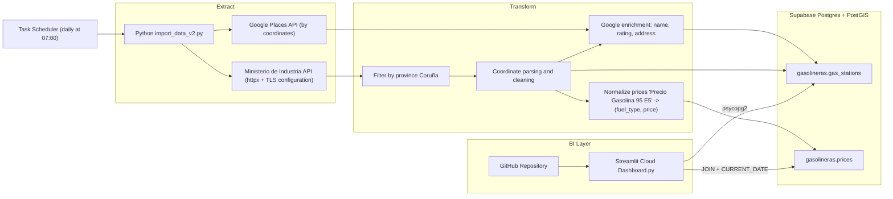
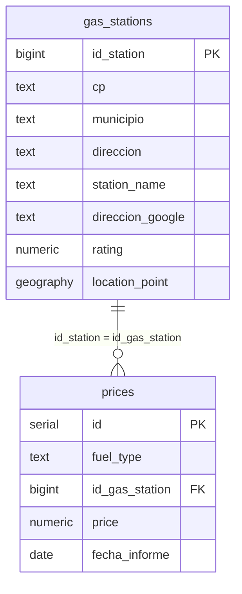

# Gas Stations ETL & Streamlit Dashboard (A Coruña)

### Overview
This project automates the collection, cleaning, and visualization of fuel price data in the province of **A Coruña, Spain**.  
Every day, a Python script downloads fresh data from the official Ministerio de Industria API, enriches it with **Google Places API** data, stores it in **Supabase (PostgreSQL + PostGIS)**, and visualizes the results in an **interactive Streamlit dashboard**.

---

## ETL Architecture

---

## Data Model (ER Diagram)

---

## Tech Stack

| Category | Technology |
|-----------|-------------|
| **Language** | Python 3.11+ |
| **Database** | Supabase (PostgreSQL + PostGIS) |
| **Interface** | Streamlit Cloud |
| **HTTP Clients** | httpx, requests |
| **Libraries** | psycopg2, dotenv, pandas, folium, geopy |
| **Scheduler** | Windows Task Scheduler (local) |
| **Code Hosting** | GitHub |

---

## How It Works

1. **`import_data_v2.py`**  
   - Fetches JSON from [Ministerio de Industria API](https://sedeaplicaciones.minetur.gob.es/ServiciosRESTCarburantes/PreciosCarburantes/EstacionesTerrestres/)  
   - Filters only the province *A Coruña*  
   - Enriches stations with *Google Places API*  
   - Saves updated data into Supabase (tables `gasolineras.gas_stations` and `gasolineras.prices`)

2. **`Dashboard.py`**  
   - Runs on **Streamlit Cloud**  
   - Connects to Supabase via `psycopg2`  
   - Displays an interactive dashboard with:
     - Fuel type filter  
     - Address search  
     - Top-10 nearest stations  
     - Map visualization using Folium

---

## Automation
- The `import_data_v2.py` script runs **daily at 07:00** via Windows Task Scheduler.  
- The results are stored in the cloud database (Supabase).  
- The Streamlit dashboard automatically reflects the most recent data.

---

## Demo
- **Dashboard (Streamlit Cloud):** [[Dashboard Link](https://thfu5xjpz3f2danqkbxaxa.streamlit.app/)]  
- **Source Code:** [[GitHub Repository Link](https://github.com/veronikasavostyanova1996-svg/gas_station)]

---

## Author
**Savostianova Veronika**  
Data Analyst 
LinkedIn: [LinkedIn Profile](https://www.linkedin.com/in/veronika-savostianova/)  
GitHub: [github.com/veronikasavostyanova1996-svg](https://github.com/veronikasavostyanova1996-svg)
